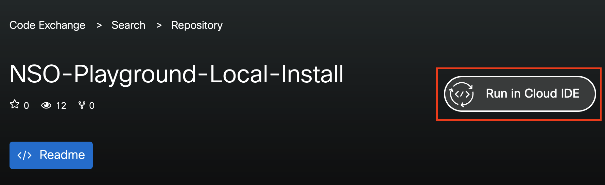
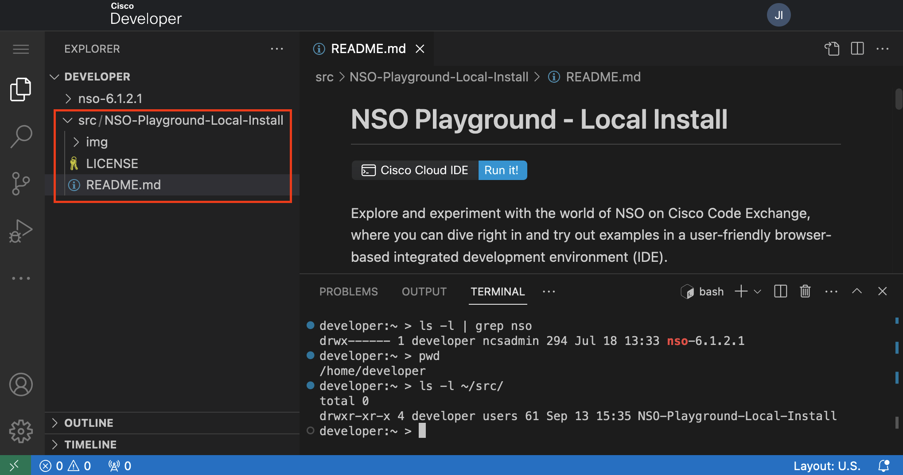
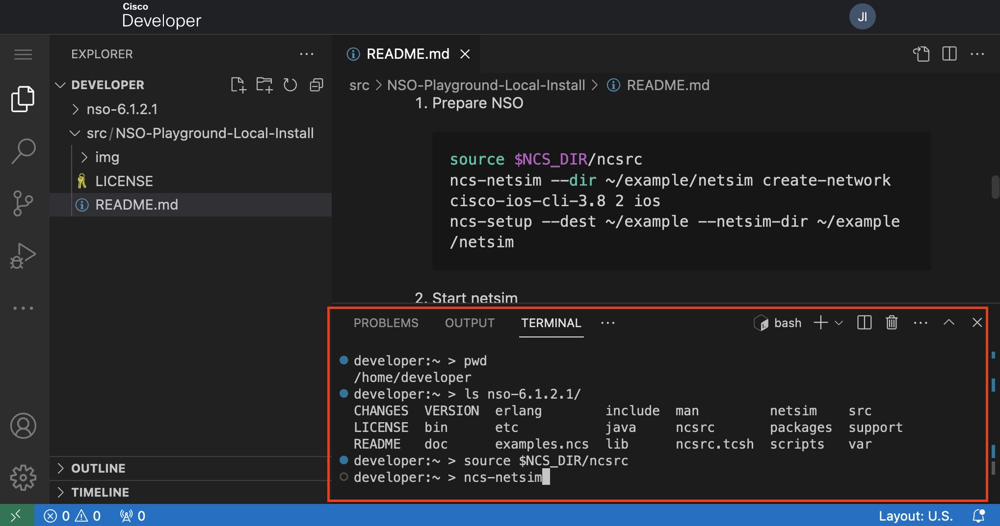
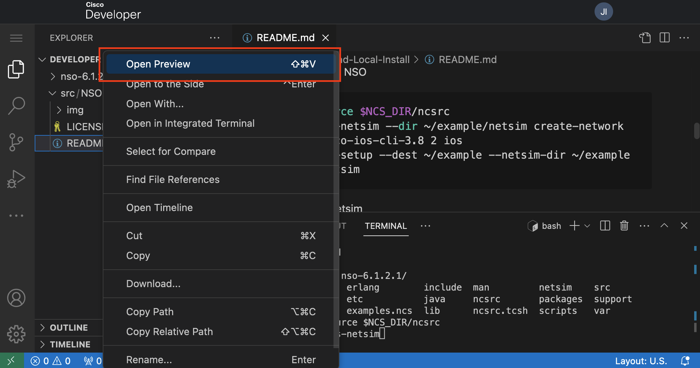

# NSO Playground - Local Install

[](https://developer.cisco.com/codeexchange/devenv/CiscoDevNet/NSO-Playground-Local-Install)

Explore and experiment with the world of NSO on Cisco Code Exchange, where you can dive right in and try out examples in a user-friendly browser-based integrated development environment (IDE).

But wait, there's more! You can also contribute your examples and share them with everyone. The best part is your peers can play with your examples without installing anything.

If you are new to NSO, start with [NSO learning labs](https://developer.cisco.com/learning/search/?contentType=track,module,lab&keyword=nso&sortBy=luceneScore) where you will find step by step guides prepared by Cisco.

## Explore

Click [here to start using Cisco Cloud IDE](https://developer.cisco.com/codeexchange/devenv/CiscoDevNet/NSO-Playground-Local-Install)

Or go to [Cisco Code Exchange](https://developer.cisco.com/codeexchange/github/repo/CiscoDevNet/NSO-Playground-Local-Install/) and start the environment. Click on the **Run in Cloud IDE** button on the right side of the Repo title.



Once you click the **Run in Cloud IDE** button, you will see a VS Code instance prepared with the Git repo clone. **You will find your code under the ~/src directory**

> Note: Click on the **src** directory to expand it and see the code of the repo cloned. **Pay attention to the directory structure of the workspace.**



## How can I add my own example?

1. Simply submit your repo on <https://developer.cisco.com/codeexchange/submit/>
2. Once your submission is approved, your repository will be featured on the [Cisco Cloud IDE](https://developer.cisco.com/codeexchange/search/?complexity=devenv)
3. That's it! Now you can start exploring, playing, and sharing your awesome examples. Let the creativity flow!

## Need help?

[Open an issue on this repository](https://github.com/CiscoDevNet/NSO-Playground-Local-Install/issues) to ask for help, share feedback or request new features.

## Need an example?

Try the example below to get familiar with the Cloud IDE Environment. Copy or type the commands below into the **VS Code terminal.**



This short example will demonstrate how to set up a simulated network of Cisco IOS routers and manage these with NSO in Code Exchange Cloud IDE. NSO will talk Cisco CLI towards the routers.

> If you want to see a detailed explanation of the commands below see [NSO Intro Learning Lab](https://developer.cisco.com/learning/labs/nso-intro/introduction/)

1. Prepare NSO

   ```bash
   source $NCS_DIR/ncsrc
   ncs-netsim --dir ~/example/netsim create-network cisco-ios-cli-3.8 2 ios
   ncs-setup --dest ~/example --netsim-dir ~/example/netsim
   ```

2. Start netsim

   ```bash
   cd ~/example/
   ncs-netsim start
   ```

3. Start NSO

   ```bash
   ncs
   ```

4. Review NSO status

   ```bash
   ncs --version
   ncs --status | grep -i status
   ```

5. Enter NSO and learn the configuration of `ios0`.

   ```bash
   ncs_cli -C -u admin
   devices sync-from
   ```

6. See the configuration of `ios0` and change the hostname.

   ```bash
   config
   show full-configuration devices device ios1 config | nomore
   devices device ios0 config
   ios:hostname nso.cisco.com
   ```

7. Finally see what NSO will send to the device and commit the changes.

   ```bash
   top
   commit dry-run outformat native
   commit
   ```

### Explore and play with the NSO Example Collection

Go to `$NCS_DIR` > `examples.ncs` in the VS Code workspace or use the terminal

```bash
cd $NCS_DIR/examples.ncs/
developer:examples.ncs > ll
total 28
drwxr-xr-x 1 developer ncsadmin   267 Jun 28 11:38 .
drwx------ 1 developer ncsadmin   294 Jul 18 13:33 ..
-rw-r--r-- 1 developer ncsadmin 27052 Jun 28 11:38 README
drwxr-xr-x 1 developer ncsadmin    27 Jun 28 11:05 crypto
drwxr-xr-x 1 developer ncsadmin    36 Jun 28 11:05 datacenter
drwxr-xr-x 1 developer ncsadmin   261 Jun 28 11:38 development-guide
drwxr-xr-x 1 developer ncsadmin    27 Jun 28 11:05 generic-ned
drwxr-xr-x 1 developer ncsadmin    50 Jun 28 11:05 getting-started
drwxr-xr-x 1 developer ncsadmin    26 Jun 28 11:05 high-availability
drwxr-xr-x 1 developer ncsadmin    69 Jun 28 11:05 misc
drwxr-xr-x 1 developer ncsadmin   143 Jun 28 11:05 service-provider
drwxr-xr-x 1 developer ncsadmin    19 Jun 28 11:05 snmp-ned
drwxr-xr-x 1 developer ncsadmin   155 Jun 28 11:38 snmp-notification-receiver
drwxr-xr-x 1 developer ncsadmin    53 Jun 28 11:05 web-server-farm
drwxr-xr-x 1 developer ncsadmin    31 Jun 28 11:05 web-ui
```

## Guidelines

- Code shared is public, **avoid any confidential information.**

## Recommendations

- It is recommended to avoid specifying NSO versions in the code, as the underlying NSO will be upgraded with newer releases.
- As seen in the examples use environment variables when developing.
  - `$NCS_DIR` is a handy environment variable.
  - Use `env | grep -i ncs` to see the environment variables available by `ncs`.
- The directory structure of the workspace matters, consider it when creating an example.
- Use the **preview** feature (right click) in VS Code to the see the markdown files formatted.

   

## FAQ

- What NEDs come with the container?

  - Example NEDs. These should be considered as examples. NEDs in the container are only used to run the simulated networks. Do not use these with real devices.

    ```bash
    developer:~ > ls -1 $NCS_DIR/packages/neds/
    a10-acos-cli-3.0
    alu-sr-cli-3.4
    cisco-asa-cli-6.6
    cisco-ios-cli-3.0
    cisco-ios-cli-3.8
    cisco-iosxr-cli-3.0
    cisco-iosxr-cli-3.5
    cisco-nx-cli-3.0
    dell-ftos-cli-3.0
    juniper-junos-nc-3.0
    developer:~ > ls -1 $NCS_DIR/packages/neds/ | wc -l
    10
    developer:~ >
    ```

- My code is approved, but I don't see it?
  - Expand the `/home/developer/src` in the workspace
  - or do `ls -l /home/developer/src`
