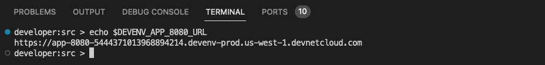

# NSO Playground - Local Install

[](https://developer.cisco.com/codeexchange/devenv/CiscoDevNet/NSO-Playground-Local-Install)

Explore and experiment with the world of NSO on Cisco Code Exchange, where you can dive right in and try out examples in a user-friendly browser-based integrated development environment (IDE).

But wait, there's more! You can also contribute your examples and share them with everyone. The best part is your peers can play with your examples without installing anything.

If you are new to NSO, start with the [NSO Learning Labs](https://developer.cisco.com/learning/search/?contentType=track,module,lab&keyword=nso&sortBy=luceneScore), where you can find step-by-step guides.

## Variants

Two **flavors** of the NSO Playground are available. Choose the environment that suits you best:

- Local install. This repository is associated with this environment.
- System install. This variant is based on the official NSO container.
  - [See the System Install repository for more information.](https://github.com/CiscoDevNet/NSO-Playground-System-Install)

See [this guide](https://developer.cisco.com/docs/nso/#!getting-and-installing-nso/local-vs-system-installation) to learn the difference between System and Local install.

The rest of this guide focuses on the Local Install option.

## Explore

Click [here to start using Cisco Cloud IDE.](https://developer.cisco.com/codeexchange/devenv/CiscoDevNet/NSO-Playground-Local-Install)

Or go to [Cisco Code Exchange](https://developer.cisco.com/codeexchange/github/repo/CiscoDevNet/NSO-Playground-Local-Install/) and start the environment. Click on the **Run in Cloud IDE** button on the right side of the Repo title.


Once you click the **Run in Cloud IDE** button, a Cloud IDE instance with the Github repository appears. **You find your code under the ~/src directory.**

> **Note:** Click on the **src** directory to expand it and see the code of the repo cloned. **Pay attention to the directory structure of the workspace.**


## How can I add my own example?

To create a new example, follow these steps.

> **Note:** You must use your own repositories.

1. Develop your example locally on your computer.
   1. You can also develop an example on the Playground, but keep in mind the guidelines, especially the 2-hour container lifespan.
2. Push your example to the default branch of your GitHub repository.
3. In your README.md file, specify the NSO variant (System, Local install) you used for your example.
4. Submit your repository on <https://developer.cisco.com/codeexchange/submit/>
5. Once your submission is approved, your repository will be featured on the [Cisco Cloud IDE.](https://developer.cisco.com/codeexchange/search/?complexity=devenv)
6. Congratulations! You can now start exploring, playing, and sharing your awesome examples. Let your creativity flow!

## Need help?

[You can open an issue on this repository](https://github.com/CiscoDevNet/NSO-Playground-Local-Install/issues) to ask for help, share feedback, or request new features.

## Need an example?

You can try the following example to get familiar with the Cloud IDE Environment. Copy or type the next commands into the **VS Code terminal.**


This short example demonstrates how you can set up a simulated network of Cisco IOS routers and manage these netsim devices with NSO in Code Exchange Cloud IDE. NSO talks Cisco CLI towards the routers.

> If you want to see a detailed explanation of the commands used, see [NSO Intro Learning Lab.](https://developer.cisco.com/learning/labs/nso-intro/introduction/)

1. Prepare NSO

   ```bash
   source $NCS_DIR/ncsrc
   ncs-netsim --dir ~/example/netsim create-network cisco-ios-cli-3.8 2 ios
   ncs-setup --dest ~/example --netsim-dir ~/example/netsim
   ```

2. Start netsim

   ```bash
   cd ~/example/
   ncs-netsim start
   ```

3. Start NSO

   ```bash
   ncs
   ```

4. Review NSO status

   ```bash
   ncs --version
   ncs --status | grep -i status
   ```

5. Enter NSO and learn the configuration of `ios0`.

   ```bash
   ncs_cli -C -u admin
   devices sync-from
   ```

6. See the configuration of `ios0` and change the hostname.

   ```bash
   config
   show full-configuration devices device ios1 config | nomore
   devices device ios0 config
   ios:hostname nso.cisco.com
   ```

7. Finally see what NSO sends to the device and commit the changes.

   ```bash
   top
   commit dry-run outformat native
   commit
   ```

### Explore and play with the NSO Example Collection

Go to `$NCS_DIR` > `examples.ncs` in the VS Code workspace or use the terminal.

```bash
cd $NCS_DIR/examples.ncs/
developer:examples.ncs > ll
total 28
drwxr-xr-x 1 developer ncsadmin   267 Jun 28 11:38 .
drwx------ 1 developer ncsadmin   294 Jul 18 13:33 ..
-rw-r--r-- 1 developer ncsadmin 27052 Jun 28 11:38 README
drwxr-xr-x 1 developer ncsadmin    27 Jun 28 11:05 crypto
drwxr-xr-x 1 developer ncsadmin    36 Jun 28 11:05 datacenter
drwxr-xr-x 1 developer ncsadmin   261 Jun 28 11:38 development-guide
drwxr-xr-x 1 developer ncsadmin    27 Jun 28 11:05 generic-ned
drwxr-xr-x 1 developer ncsadmin    50 Jun 28 11:05 getting-started
drwxr-xr-x 1 developer ncsadmin    26 Jun 28 11:05 high-availability
drwxr-xr-x 1 developer ncsadmin    69 Jun 28 11:05 misc
drwxr-xr-x 1 developer ncsadmin   143 Jun 28 11:05 service-provider
drwxr-xr-x 1 developer ncsadmin    19 Jun 28 11:05 snmp-ned
drwxr-xr-x 1 developer ncsadmin   155 Jun 28 11:38 snmp-notification-receiver
drwxr-xr-x 1 developer ncsadmin    53 Jun 28 11:05 web-server-farm
drwxr-xr-x 1 developer ncsadmin    31 Jun 28 11:05 web-ui
```

### More Playground examples?

Go to [Cisco Code Exchange](https://developer.cisco.com/codeexchange/search/?complexity=devenv&products=NSO) to find more examples created by the community.

## Guidelines

- **Avoid any confidential information.** When you share code, it becomes public.
- NSO Playground is designed for short "_How-to_" examples. Consider the following points when you create instructions:
  - The NSO Playground container is **ephemeral**. Save your work in your remote GitHub repository if you want to keep it.
    - To save your work permanently, remember to **merge** your changes in your remote GitHub repository.
  - The container in the NSO Playground has a lifespan of **2 hours.** After 2 hours, the system automatically destroys the container.
    - The system prompts you to start a new session to continue working.
    - Time starts the moment that you access the URL of the NSO Playground environment.
  - If you must work on NSO for a longer time, consider using a [free NSO evaluation copy](https://developer.cisco.com/docs/nso/#!getting-and-installing-nso/download-your-nso-free-trial-installer-and-cisco-neds) or [reserve a free DevNet Sandbox.](https://developer.cisco.com/site/sandbox/)
- You can use only one environment at a time in Code Exchange.
  - If you open multiple environments for the same user, Code Exchange closes the oldest environment.

## Recommendations

- Create examples with an "_Infrastructure as a Code_" mindset. This means everything needed to create your examples is in your GitHub repository.
- Avoid specifying NSO versions in the code, we update the playground continuously.
- As seen in the examples, use environment variables when developing.
  - `$NCS_DIR` Is a handy environment variable.
  - `env | grep -i ncs` Shows other environment variables available by `ncs`.
- The directory structure of the workspace matters. Consider it when creating an example.
- Always add a README.md file to the root directory of your repository with instructions on how to set up or run your example.
- Use the **preview** feature (right click) in VS Code to see the markdown files formatted.

   

## FAQ

- Where is the NSO webUI?

  - Assuming you are using the default port 8080, you can obtain the URL from the `DEVENV_APP_8080_URL` environment variable in your terminal. The webUI default credentials are: `admin/admin`

    ```bash
    echo $DEVENV_APP_8080_URL
    ```

    

    

  - If you're not sure which port to use, check the available environment variables with.

    ```bash
    env | grep -i devenv_app
    ```

- Can I reset the environment?

  - Yes, click on the reset button at the bottom-right corner. This action full resets the container.

      

  - If you want to keep some work, make sure you save it on your remote GitHub repository first.

- How to enable the [VS Code NSO Developer Studio - Explorer?](https://marketplace.visualstudio.com/items?itemName=CiscoCrossworkNSO.nso-explorer).

  - This extension is already present on the playground.
  - To use the extension, follow next the steps:
    - Enable the NSO webUI and authentication. Default on local install.
    - Refresh the explorer extension (load icon inside the extension).

- Which NEDs come with the container?

  - Example NEDs, which must be considered as examples. NEDs in the container are only used to run the simulated networks. Do not use these example NEDs with real devices.

    ```bash
    developer:~ > ls -1 $NCS_DIR/packages/neds/
    a10-acos-cli-3.0
    alu-sr-cli-3.4
    cisco-asa-cli-6.6
    cisco-ios-cli-3.0
    cisco-ios-cli-3.8
    cisco-iosxr-cli-3.0
    cisco-iosxr-cli-3.5
    cisco-nx-cli-3.0
    dell-ftos-cli-3.0
    juniper-junos-nc-3.0
    developer:~ > ls -1 $NCS_DIR/packages/neds/ | wc -l
    10
    developer:~ >
    ```

- My code is approved and is already published on Cisco Code Exchange, why isn't it visible on the playground?

  - Expand the `/home/developer/src` in the workspace.
  - Or do: `ls -l /home/developer/src`
